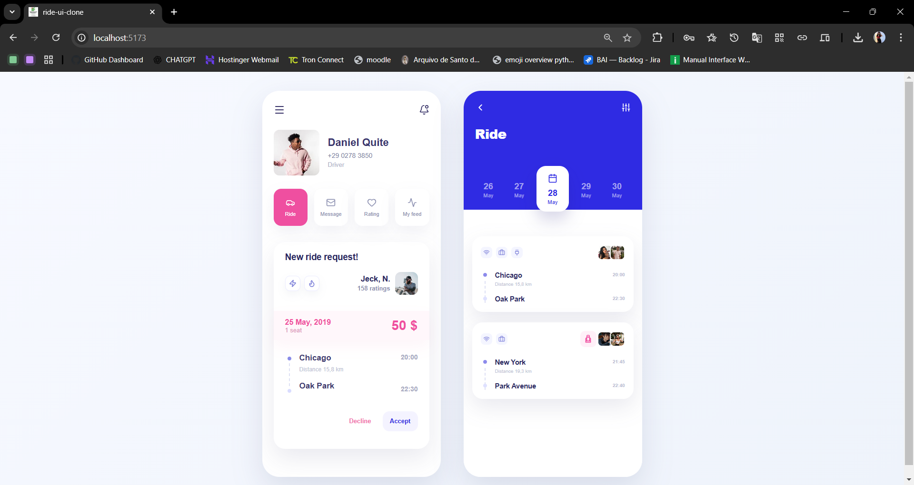

# Projeto de Replicação de Interface Mobile

Este projeto foi desenvolvido como atividade acadêmica da disciplina optativa de **Web Design**.

O objetivo do trabalho é replicar, em formato de página web responsiva, uma interface mobile fornecida como referência. A proposta envolve a reprodução visual de duas telas principais de um aplicativo de viagens/corridas, considerando layout, cores, tipografia, espaçamentos, sombras, bordas arredondadas e interações básicas.

## Objetivo

Criar uma página web responsiva que simula duas telas mobile:

* Tela de solicitação de nova corrida, com perfil do motorista, botões de ação e card de solicitação.
* Tela de detalhes da viagem, com cabeçalho, calendário interativo e cards de rotas.

## Tecnologias utilizadas

* React
* TypeScript
* Vite
* CSS
* Lucide React

## Funcionalidades

* Replicação visual das telas propostas no modelo.
* Estruturação do projeto em componentes reutilizáveis.
* Uso de ícones com a biblioteca Lucide React.
* Calendário com estado visual de seleção.
* Layout responsivo simulando telas mobile.

## Estrutura do projeto

```txt
src/
 ├── assets/
 ├── components/
 │    ├── ActionButton.tsx
 │    ├── CalendarSelector.tsx
 │    ├── MobileScreen.tsx
 │    ├── ProfileHeader.tsx
 │    ├── RideCard.tsx
 │    ├── RideRequestCard.tsx
 │    └── RouteInfo.tsx
 ├── Pages/
 │    ├── NewRideRequest.tsx
 │    └── RideDetails.tsx
 ├── App.tsx
 ├── App.css
 ├── index.css
 └── main.tsx
```

## Como executar o projeto

Primeiro, instale as dependências:

```bash
npm install
```

Depois, execute o projeto em ambiente de desenvolvimento:

```bash
npm run dev
```

Acesse no navegador:

```txt
http://localhost:5173/
```

## Sobre o desenvolvimento

O projeto foi desenvolvido com foco na fidelidade visual da interface original, utilizando componentes para organizar melhor o código e facilitar a manutenção. A estilização foi feita com CSS, aplicando conceitos de Flexbox, Grid, responsividade, sombras, espaçamentos e arredondamento de bordas.

## Status do projeto

Concluído.

## Interface de Referência

Imagem utilizada como base para a replicação da interface mobile.


## Resultado Desenvolvido

Resultado final implementado com React, TypeScript, Vite e CSS.

